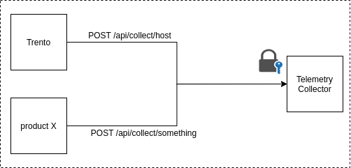

# **Telemetry**

>Telemetry is the in situ collection of measurements or other data at remote points and their automatic transmission to receiving equipment (telecommunication) for monitoring.
>
[Telemetry, Wikipedia](https://en.wikipedia.org/wiki/Telemetry)

---
## **Pitch**

At SUSE we believe in [continuous improvement](https://en.wikipedia.org/wiki/Kaizen), and we want our products get better over time and as our customers' needs change.

In this process we will have to make decisions, and we believe that a wide range of *inputs*, *perspectives* and *information* will help us in making better decisions.

This is why, next to a close feedback-based collaboration with our customers, we are coming with this **Telemetry Service**, which is responsible of collecting meaningful inputs for our improvement.

Telemetry is used by SUSE to make the products better and is not shared with third-parties.

---
## **Concepts**

### **Telemetry**
Anonymous information collected to provide extra feedbacks to the organization for strategic decisions towards improvement.

eg. *number of CPUs*, *SLES version*, *Cloud Provider*

### **Source**
A Source is possibly any of the products/services that [SUSE offers](https://www.suse.com/products/) which can be enabled to publish telemetry.


For instance 
- Trento
- SUSE Linux Enterprise Server
- SUSE Linux Enterprise Server for SAP Applications
- others...

Every *Source* is free to define its own telemetry and responsible to implement its *Extraction* and subsequent *Publishing* to the Telemetry Service.

### **Telemetry Service**

Telemetry Service (aka *Collector Service*, *Telemetry Collector Service*) is an application whose main responsibility is to collect meaningful **Data** being published by different **Sources**.


and *process* (?) that information in order to make it Consumption-ready.

### **Consumption**

The consumption of the collected data is out of the scope of this service at the moment, but the core tenet stands that said consumption is only done with the purpose of establishing a closed feedback loop to improve our products.

### **Basic Flow**


A **Source** extracts **Telemetry data** and publishes it to a **Telemetry Collector Service**. Upon **Consumption** the collected information becomes precious **feedback for improvement**.

---
## **Big Picture**


Any of the SUSE products or services enabled for Telemetry collection *defines*, *extracts* and then ***securely publishes*** Telemetry data to the Collection Service which is responsible to make collected data available for Business Intelligence whose outcome is products improvements based on collected information.

---
## **Extraction-Publishing-Collection**
Given the diversity of the products offered in terms of purpose, strategic impact, technologies, ecosystems, age... each of the **Sources** is responsible for the definition of what's important for them to collect (aka the **Telemetry**), the actual **Extraction** from the system (retriveal of data from any reasonable location it might be necessary) and the integration of [**secure publishing**](###communication-security) to the **Telemetry Collector Service** via HTTPS endpoint(s) it exposes



**Note:** the endpoints mentioned in previous picture are just samples, a more stable contract needs to be defined.

### **Extraction Process**
There is no strict requirement for the **Source** on how to **Extract** the **Telemetry**.
The Source knows its own *world* and how to extract the data it needs.

### **Publishing**
Publishing at the moment means making an HTTP(S) POST request to the **Telemetry Collector Service** and this integration happens at a **Source** level.

In the future we might want to provided client librabries/SDKs to make the integration easier.

#### **Publishing Contracts**
As mentioned the communication goes over an HTTP(S) POST request with a JSON payload.

```json
{
    "application": "<the-source>",
    "telemetry_type": "host_telemetry",
    "time": "2021-11-23T11:04:02.462687463+01:00",
    "payload": ... whatever the Source has extracted and wants to publish
}
```

Example of what Trento Publishes in relation to what has been defined as *Host Telemetry*, which gives SUSE insights about the SAP System where Trento is installed.

```json
{
    "application": "trento",
    "telemetry_type": "host_telemetry",
    "time": "2021-11-23T11:04:02.462687463+01:00",
    "payload": [
        {
            "installation_id": "7826342e-8888-8888-8888-253f89af9127",
            "agent_id": "e93c2b22-5555-5555-8666-12372d2cb8ac",
            "sles_version": "15-SP2",
            "cpu_count": 2,
            "socket_count": 8,
            "total_memory_mb": 4096,
            "cloud_provider": "azure",
            "time": "2021-11-23T11:04:02.462687463+01:00"
        },
        {
            "installation_id": "7826342e-8888-8888-8888-253f89af9127",
            "agent_id": "e93c2b22-4444-4444-4444-12372d2cb8ac",
            "sles_version": "15-SP2",
            "cpu_count": 2,
            "socket_count": 8,
            "total_memory_mb": 4096,
            "cloud_provider": "azure",
            "time": "2021-11-23T11:04:02.462687463+01:00"
        }
    ]
}
```
(FTR: actually, atm, Trento is publishing the plain payload, without any wrapping structure. For service generalization purposes these communication contracts need to be refined and stabilized)

### **Communication Security**
T.B.D.

## **Storage**
In order to make the collected information available for consumption and BI, we currently store the collected **Telemetry** in:
- Influxdb
- Postgresql

At the moment these systems are where we can query the collected information.

## **Analytics and Business Intelligence**
T.B.D.

## **Giveback to the customer base**
All of this to give back improved products to our customers.